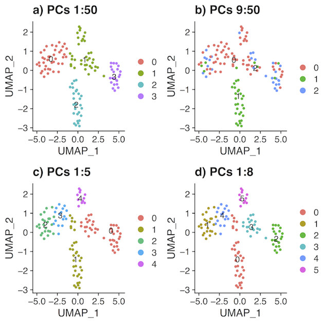
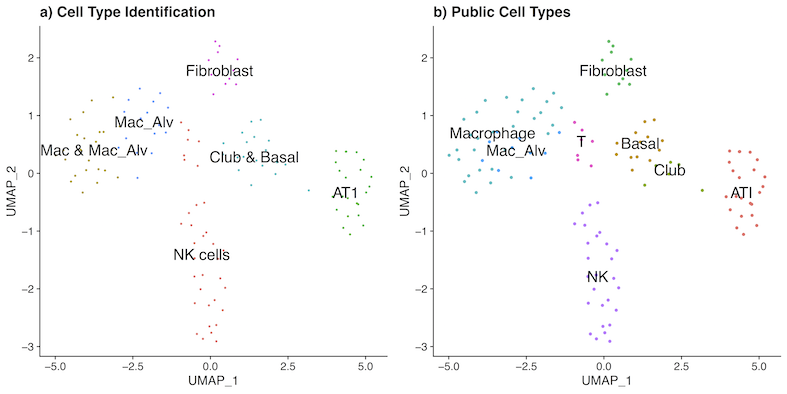

```{r setup, include = FALSE}
knitr::opts_chunk$set(
  collapse = TRUE,
  comment = "#>",
  fig.width = 7, 
  fig.height = 5
)
```

## Introduction

The R `dimension` package provides an efficient way to determine the dimension of a signal-rich subspace in a large, high-dimensional matrix. It also provides a denoised estimator of the original matrix and the correlation matrix. Source code is maintained at [https://github.com/WenlanzZ/dimension](https://github.com/WenlanzZ/dimension).

The `dimension` package constructs a signal-rich subspace within a large, high-dimensional matrix by decomposing it into a signal-plus-noise space and estimate the signal-rich subspace with a rank $K$ approximation $\hat{X}=\sum_{k=1}^{K}d_ku_k{v_k}^T$. We propose a procedure to estimate the rank $K$ of the matrix, thereby retaining components whose variation is greater than that of random matrices, whose eigenvalues follow an universal Marchenko-Pastur distribution.

The package includes the following main functions:

- subspace() - Create a subspace class with scaled eigenvalues and eigenvectors and simulated noise eigenvalues for specified ranks.
- print.subspace()- Get a brief summary of a subspace class.
- plot.subspace() - Get the scree plot of a subspace class.
- dimension() - Get the dimension of a signal-rich subspace in a large, high-dimensional matrix.
- truancate() - Get a denoised estimator of the original matrix, its covariance matrix and correlation matrix.
- print.subspace_denoised() - Get a brief summary of a subspace_denoised class.
- modified\_legacyplot() - Produces modified summary plots of bcp() output.

A demonstration of the main functions with a brief example follows.

## IPF Single Cell Atlas

The IPF Single Cell Atlas (`lung`) data can be found on Gene Expression Omnibus (GSE136831). This data was examined by [Adams et  al.(2019)](https://www.biorxiv.org/content/10.1101/759902v1.full.pdf) to build a single cell atlas of Idiopathic Pulmonary Fibrosis (IPF). It contains the gene expression of 312,928 cells profiled from 32 IPF patient lung samples, 18 chronic obstructive pulmonary disease (COPD) lung samples and 28 control donor lung samples.

Applying `dimension` package to a small subgroup of control lung sample (id 001C) with 2000 genes and 127 cells (due to CRAN limitation on data size), the `dimension()` function will first construct a `Subspace` within the ambient space. The `subspace()` function will utilize [`irlba`](https://cran.r-project.org/web/packages/irlba/index.html) to calculate the first few approximate largest eigenvalues and eigenvectors of a matrix $X$. The `irlba()` function uses about 1/20 elapsed time compared to the standard `svd()` method and less than 1/3 the peak memory. The `subspace()` function also returns random generation for the Marchenko-Pastur (MP) distribution with [`RMTstat`](https://cran.r-project.org/web/packages/RMTstat/index.html). To compare eigenvalues of $X$ to random samples from the MP distribution, we scale eigenvalues dividing by ${\beta p}$ ($\beta = 1$ for real value entries). When $n$ or $p$ is relatively large, it is necessary to speed up computation by splitting into {\tt times}-fold with [`foreach`](https://cran.r-project.org/web/packages/foreach/index.html). Sampling from the MP distribution, instead of calculating eigenvalues from a random Gaussian matrix, is a strategy to avoid computer memory or power limitations. Thus, `dimension` is more scalable and computationally efficient, especially for large matrices.

The following code demonstrates the incorporation of `dimension` in single-cell RNA-Seq analysis as a powerful tool for signal extraction and cell type identification.

### Dimension

```{r}
setwd("/Users/wz262/Projects/dimension")
devtools::load_all()
set.seed(1234)

#load matrix from Adams et al.2019
data(lung)
options(mc.cores=2)
system.time({results <- dimension(lung, components = 1:50)})
plot(results$Subspace, changepoint = results$dimension, annotation = 10)
```

The output message from the `dimension()` function includes the specified components calculated in the function, the variance parameter used to generate random samples from Marchenko-Pastur distribution, the cutoff value to define "zero" differences between posterior probabilities of change points, and detecting flat or spike pattern to speed up calculation and avoid systematic errors. A scree plot of scaled eigenvalues of $X$ matrix and random matrices can be examined visually by the `plot()` function with a `Subspace` class as the argument.

```{r}
# double check with Bayesian change point posterior probabilities
modified_legacyplot(results$bcp_irl)
```

Output from `modified_legacyplot()` shows the posterior means and posterior probabilities of change points in a given sequence. The legacy plot shows that there are equally high posterior probabilities of change points at dimension 1, 2, 3, 4, 7 and 8. The `dimension()` function looks at the legacy plot from right to left for the maximum posterior probability of change point (8 in this example).

We followed the suggested pipeline in the `Seurat` package (see [details](https://satijalab.org/seurat/v3.1/pbmc3k_tutorial.html)) and determined the signal dimension of 5 using the `JackStraw()` function. We then applied the louvain clustering method implemented `Seurat` for PCs from 1:50, 9:50, 1:5 and 1:8 (see [details](https://rpubs.com/WenlanzZ/578132)). The UMAP for each of plot confirmed that major features for cell type clustering depend on dimension 1 to 8 and there is no new cluster formed from dimension 9 to 50. Clustering from `dimension` estimated signal subspace identified two additional cluster that is masked in the whole space, while clustering from `JackStraw()` estimated signal subspace failed to separate cluster 0. 



To validate the clustering results, we identify marker genes in each cluster via differential expression and further match the clustering results to known cell types with identified marker genes.

```{r table2, echo=FALSE, message=FALSE, warnings=FALSE, results='asis'}
tabl <- "
| Cluster ID |    Markers           |     Cell type                     |
|----------- |:--------------------:|----------------------------------:|
| 0          |  CCL4, NKG7, GZMB    |  NK cells                         |
| 1          |  FTL, APOC1, FABP4   |  Macrophage & Macrophage_Alveolar |
| 2          |  AGER, HOPX          |  AT1                              |
| 3          |  SCGB1A1, SCGB3A2    |  Secretory cells                  |
| 4          |  ABCG1, GLDN         |  Macrophage_Alveolar              |
| 5          |  DCN, GPX3           |  Fibroblast                       |
"
cat(tabl)
```

With the identified marker genes, we can match unsupervised clusters to known cell types.



Comparing to the original identification published by [Adams et  al.(2019)](https://www.biorxiv.org/content/10.1101/759902v1.full.pdf)), most of the cells types have been correctly annotated with the small demonstration subset using PCs from 1 to 8. Except that T cells cluster together with NK cells. However, NK cells and T cells are phenotypically similar and they both derive from lymphoid lineage cells. By contrast, if we include noisy PCs all together from 1 to 50, T cells, fibroblast, and secretory cells will be misclassified all together. Similarly, if we truncate signals as suggested by Jackstraw from 1 to 5, we will miss the important PCs that separate secretory cells from AT1 cells. Therefore, an accurate estimation of the signal dimension is paramount for cell type identification to avoid clustering with overabundance of noise or signal omission, which both lead to misleading conclusions.

## Extreme cases in simulation

In an extreme simulated case, we have a high dimensional matrix $X$ simulated via model: $X = S + \epsilon$ with
$$
S[ . , 1:d] \sim N(0, \Sigma)\\ 
S[ . , (d+1):p] = 0\\
\Sigma = \left(\begin{array}{cc} 
  6 & 0 & \dots & 0 \\
  0 & 6 & \dots & 0 \\
  \vdots & \vdots & \ddots & \vdots \\
  0 & 0 & \dots & 6
\end{array}\right)
$$ 

```{r}
x <- x_sim(n = 100, p = 50000, ncc = 10, var = 6)
stime <- system.time(test <- dimension(x))
plot(test$Subspace, changepoint = test$dimension, annotation = 10)
prior <- seq(0.9, 0, length.out = 100)
suppressWarnings(
    bcp_irl  <- bcp(as.vector(test$Subspace$sigma_a - test$Subspace$sigma_mp),
                     p0 = prior))
modified_legacyplot(bcp_irl)
```

The signal inside this setting is extremely low ($100*10$ vs. $100*(50000-10)$) and the `bcp` performs less stably on the edges of the sequences. As a result, when there is a small drop between 96 and 97, the posterior probability of a change point at 97 is extremely high. Thus, we adopt an alarm system posted at [dracodoc](https://dracodoc.wordpress.com/2014/07/21/a-simple-algorithm-to-detect-flat-segments-in-noisy-signals/) for this kind of spike pattern in posterior probabilities at the edges. When it detects a spike after a long flat pattern in the sequence, it will trim off the sequence right before the spike, so that the estimation from `bcp` will be accurate and robust in extreme cases.

In another extreme simulated case when the signal pattern is very obvious, we can detect the flat pattern quickly and reduce the time of calculation on unnecessary components.

## Denoised estimation of X

With the estimated dimension from `dimension()` function, we can truncate the scaled eigenvalues of $x$ in order to provide a denoised estimator $e\_denoised$ of the underlying correlation matrix and $x\_denoised$ of the original matrix. There are three methods to chose from. The threshold method returns $(1-alpha)*rnk$ proportion of eigenvalues above threshold; the hard method returns all the empirical eigenvalues greater than the upper limit of the support to the Marchenko-Pastur spectrum; the identity method returns eigenvalues specified in a location vector. While we keep a proportion of eigenvalues, we can either shrink the remaining ones by a trace-preserving constant (i.e. $Tr(E\_denoised) = Tr(E)$) or set them all to zero. This function `truncate()` is adapted from Python for Random Matrix Theory (GiecoldOuaknin2017).

```{r}
x_denoised <- truncate(x, components = 20, method = "threshold", alpha = 0.9, zeroout = TRUE)
x_denoised <- truncate(x, components = 20, method = "hard", zeroout = FALSE)
x_denoised <- truncate(x, method = "identity", location = c(1:5))
x_denoised
```
